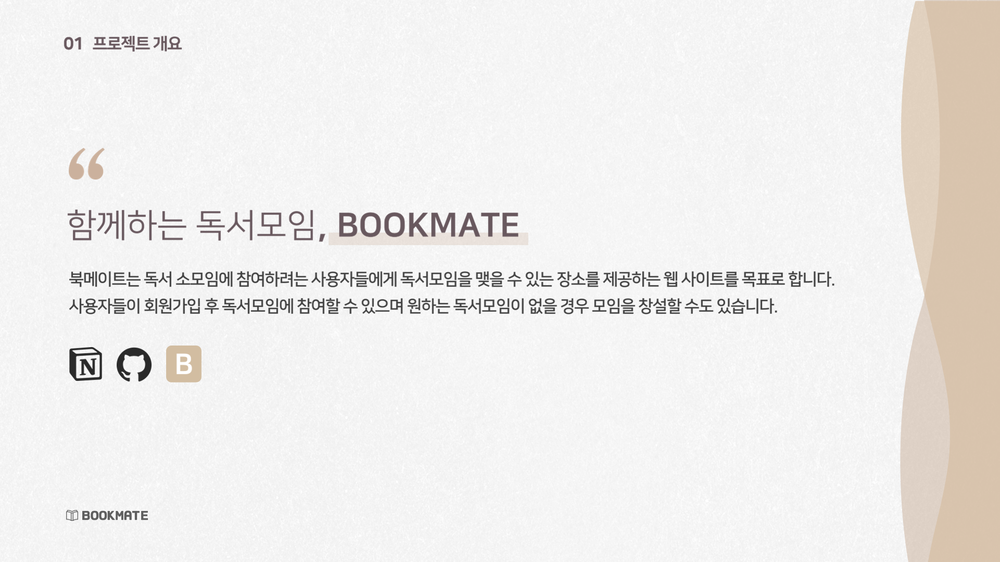
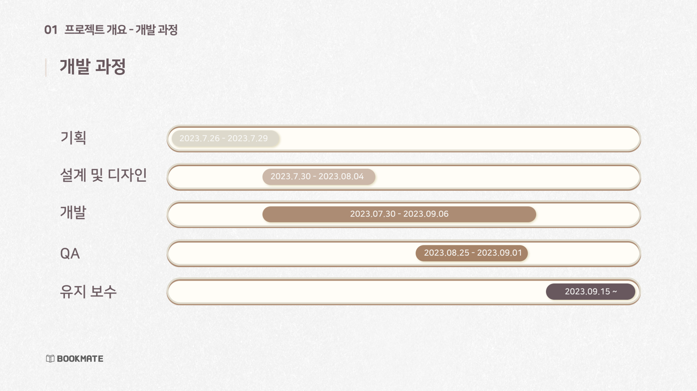
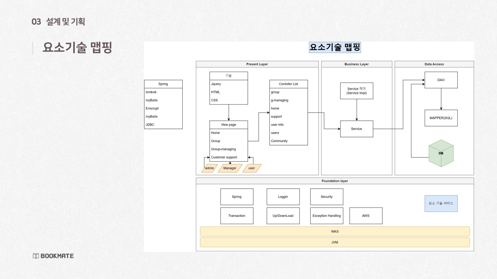
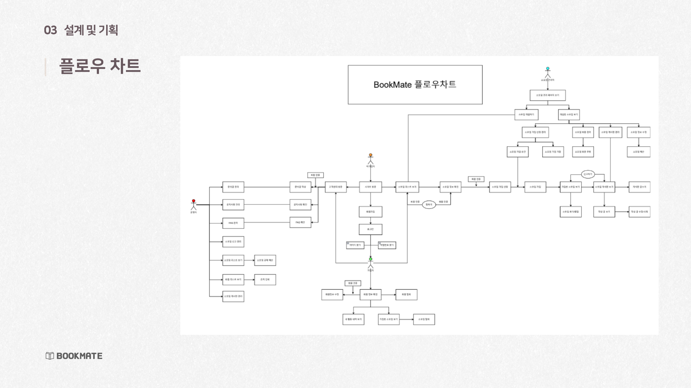
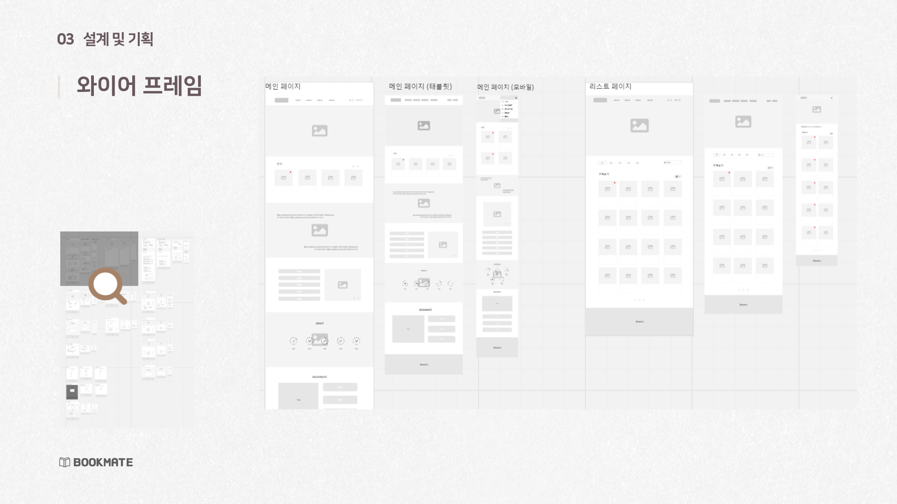
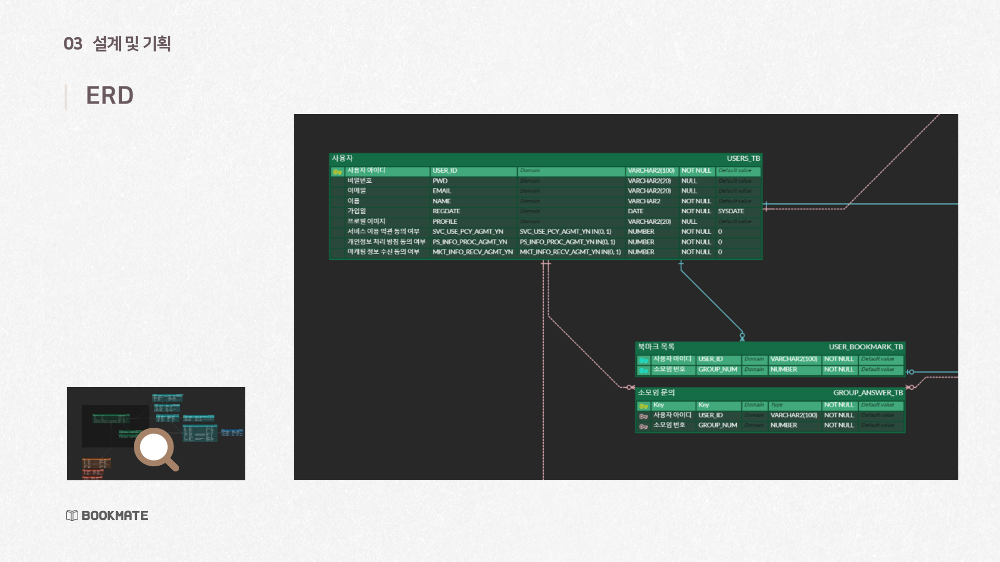
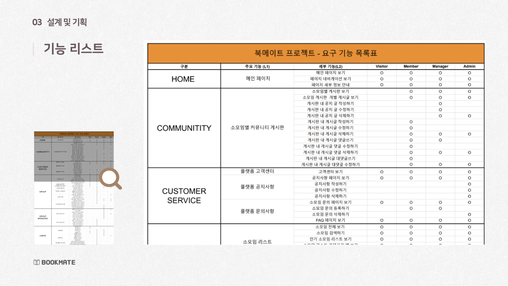
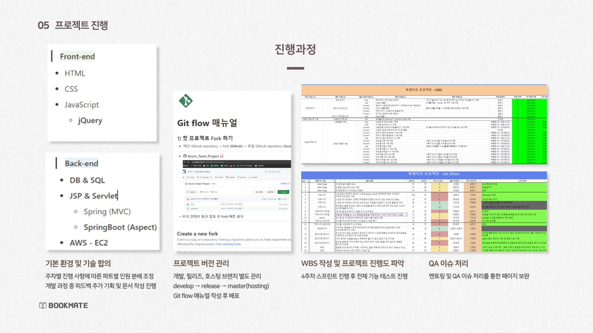

## 목차
- [개요](#-프로젝트-개요)
- [설명](#-프로젝트-설명)
- [기술 및 도구](#-기술-및-도구)
- [그 외 자료](#그-외-자료)

 

## 프로젝트 개요
### 프로젝트 명
북메이트 | Bookmate

### 분류
팀 프로젝트

### 제작 기간
2023.07.26 ~ 2023.09.22

### 링크
 
 
  
 

 

## 팀원 및 역할
 
개발 총괄  
소모임 관리 기능 개발 파트장 

 
소모임 관리 개발 파트

 
소모임 기능 개발 파트장 
백엔드 개발 전반 서포트

 
퍼블리싱 총괄 
전체 UI디자인 총괄 
소모임 리스트 개발 파트

 
소모임 커뮤니티 개발 파트

 
고객센터 개발 파트 총괄

 
서버 운영 총괄 
안드로이드 앱 개발 
DB관리 총괄 
유저 기능 개발 파트장

 
유저 기능 개발 파트

 

## 프로젝트 설명
> 북메이트는 독서 소모임에 참여하려는 사용자들에게 독서모임을 맺을 수 있는 장소를 제공하는 웹 사이트 및 어플리케이션 를 목표로 합니다.
>
> 사용자들이 회원가입 후 독서모임에 참여할 수 있으며 원하는 독서모임이 없을 경우 모임을 창설할 수도 있습니다.
> 사용자들은 책의 장르필터, 인기순/최신순 정렬, 검색기능 등을 통해 원하는 독서 모임을 쉽게 찾을 수 있으며, 관심가는 모임은 북마크에 저장해 둘 수 있습니다.
> 가입 이전 모임장소, 온/오프라인 여부, 시간, 참여자의 후기 등을 확인할 수 있습니다.
>
> 또한, 모임 내부에서 정보를 공유하고 소통할 수 있는 커뮤니티를 제공하여 온, 오프라인 관계 없이 책에 대한 이야기를 나눌 수 있습니다.

 

## 기술 및 도구
**FrontEnd** 

**BackEnd**  

**Server** 

**DataBase** 

**API** 

**Version Control / etc** 

 

## 그 외 자료

### 발표 자료

### 로고
  
